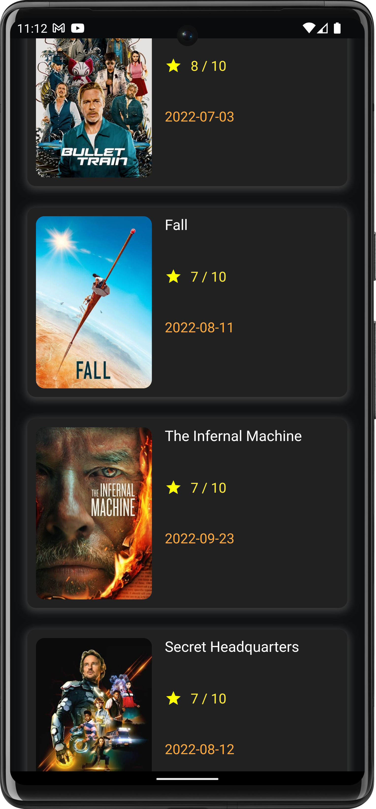
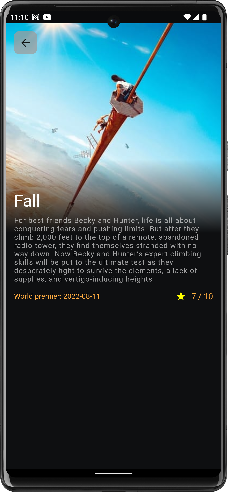

# Movify

A movie app for showing popular movies to the user using TMDB API

# Packages used
* Getx for state management , route management and Dependency injection
* Shimmer for showing loading animations while app is fetching data from the database
* Dio for making http network calls
* Cached network image for caching images

  